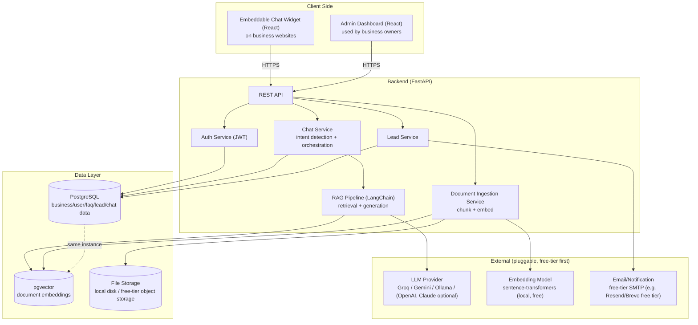

# MielikkiX — Architecture Document

## 1. System Overview

Multi-tenant SaaS. Each business ("tenant") has isolated data (FAQs, documents, leads, conversations) but shares the same application and infrastructure, distinguished by `business_id`.

## 2. Components

### 2.1 Chat Widget (React, embeddable)
- Ships as a small standalone JS bundle loaded via `` — built by `frontend/` (`vite.widget.config.ts`) and served as a static file alongside the dashboard SPA, but its own runtime API calls target `api.mielikkix.ai` (see §5), not the host it was loaded from.
- Talks only to the public chat API (`/api/chat/*`) and `/api/businesses/{id}/public-settings` — no admin credentials.
- Renders in a Shadow DOM to avoid CSS collisions with the host site.

### 2.2 Admin Dashboard (React)
- Authenticated SPA for business owners.
- Manages FAQs, documents, products/services, branding, leads, conversation history, analytics.

### 2.3 Backend API (FastAPI)
- Stateless REST API, horizontally scalable.
- Routers: `auth`, `businesses`, `faqs`, `documents`, `products`, `chat`, `leads`, `analytics`, `websites`, `admin`.
- All authenticated routes resolve `business_id` from the JWT — never trust a client-supplied tenant ID for writes. The `admin` router is the one deliberate exception: it's platform-operator-only (see §2.7) and intentionally queries across every tenant.

### 2.4 RAG Pipeline (Python, `app/rag/pipeline.py`)
1. Document uploaded → text extracted → chunked (`chunk_size`/`chunk_overlap` from settings).
2. Chunks embedded via `sentence-transformers` (local, free) and stored in `document_chunks.embedding_json` (a JSON-encoded float list), scoped by `business_id`.
3. On a chat message: embed the query, pull every chunk for that `business_id` and score them with a pure-Python cosine-similarity loop (`_cosine_similarity` in `pipeline.py`) — **not a pgvector index query**, despite the `pgvector` extension being enabled on the `db` container. This is a known gap: fine at small per-tenant document counts, but a brute-force scan that gets slower as a business's document count grows. FAQs and products are matched separately via simple keyword overlap, not embeddings.
4. Build a grounded prompt from whichever of {chunks above a confidence threshold, matched FAQs, matched products} are non-empty, call the LLM provider.
5. If nothing matches (empty context) → return the business's configured fallback message (or a default) instead of calling the LLM at all — this is the actual "fallback" path today, not a separate rule-based engine.

**Migrating to a real pgvector similarity query** (`ORDER BY embedding <=> query_embedding` with an ivfflat/HNSW index, on a native `VECTOR` column instead of `embedding_json` TEXT) is tracked as follow-up work, not yet done.

**Full-site import** (`POST /api/documents/from-website`, `app/services/document_service.py`): given just a domain, discovers every page on that site and ingests each one through the same fetch→strip→chunk→embed pipeline as the single-page `/from-url` import (`ingest_url`), rather than requiring the owner to paste in one URL at a time.
- Discovery: tries `{domain}/sitemap.xml` first (following one level of `<sitemapindex>` nesting, up to 5 nested sitemaps), falls back to a same-domain link crawl (BFS, depth 2) if no sitemap exists — see `discover_website_pages`.
- Filtered by `robots.txt` (`_get_robot_parser`) and non-page file extensions (images, PDFs, etc.), then capped at `MAX_CRAWL_PAGES` (40) regardless of plan, and further trimmed to the business's remaining `max_document_uploads` allowance before anything is queued.
- Runs as a FastAPI `BackgroundTasks` job (`crawl_and_ingest_website`) so the request returns immediately with a discovered/queued count — pages appear on the Documents page one by one as they move `processing` → `embedded`. The background job opens its own DB session (`SessionLocal()`) since the request's injected session is already closed by the time it runs; one page failing to fetch doesn't abort the rest of the batch.
- Same SSRF guard (`_assert_public_url`) as the single-page import, applied to the entered domain and to every discovered link during a link-crawl fallback.

### 2.5 LLM Provider Abstraction
- Common interface (`generate(prompt, context) -> text`) with adapters for Groq, Google Gemini, local Ollama, OpenAI, Claude.
- Default to a free-tier provider; business/tenant config can override which provider/model to use.

### 2.6 Lead Capture
- Triggered by explicit form fill or detected "lead" intent mid-conversation.
- Stored in `leads` table; optionally emailed to the business via free-tier transactional email.

### 2.7 Platform Admin Dashboard (`/admin`, React)
- A private area of the same dashboard SPA, reserved for the MielikkiX operator (not a tenant/business role) — reachable at `/admin` alongside the existing `/dashboard` routes, gated by `RequireAdmin` in `frontend/src/App.tsx`.
- Identity: the `PLATFORM_ADMIN_EMAILS` env var (comma-separated) is checked against the logged-in user's email — see `require_platform_admin` in `app/core/dependencies.py`. Not a DB column, since this is a deployment-level operator concept, not a per-tenant role; logging in still goes through the normal `/login` flow and JWT cookie.
- Shows: all registered businesses and their plan/status (`/admin/businesses`), a per-business drill-down (`/admin/businesses/{id}`), a platform KPI overview (`/admin`), and Groq LLM token usage (`/admin/usage`, backed by §2.8 below).
- Every backend route lives under `/api/admin` and is protected once at the router level by `require_platform_admin`, so nothing added later can be left unprotected.
- **No self-serve path to a paid plan.** `PATCH /api/businesses/me/plan` (the business's own dashboard) only ever accepts `"free"` — any paid value is rejected with `403`, deliberately, because no payment processor is connected anywhere in the app (checkout is a simulated UI, see `files/FEATURES.md`). Without that check, anyone who skipped the UI and called the endpoint directly (curl/Postman/Swagger) could put their own business on Growth for free; that's a monetization gap, not something the frontend's `PAYMENT_COMING_SOON` modal actually closes on its own, so the backend closes it instead.
- **Only a platform admin can set a paid plan** — `PATCH /api/admin/businesses/{id}/plan` (operator-only, any of `free`/`basic`/`business`/`growth`), exposed as a "Set plan…" control on the business detail page. This is the sole mechanism for putting a business on a paid tier until real billing exists: testing, demos, or manually activating a customer who paid through some other channel (e.g. a bank transfer, invoice).
- **Business status lifecycle** (`businesses.status`: `trial` / `active` / `suspended`) — mostly automatic, with one manual override:
  - Both plan-set paths auto-sync status: `"trial"` on Free, `"active"` on any paid plan — this is the only real "purchase" signal that exists today. The admin plan endpoint skips this sync if the business is currently `suspended`, so changing a suspended business's plan doesn't silently reactivate it.
  - The business detail page's **Suspend**/**Reactivate** buttons call `PATCH /api/admin/businesses/{id}/status` (operator-only). Suspending also force-downgrades the business to Free — standing in for what a real failed/cancelled-payment webhook would do once billing is actually wired up. Reactivating only flips status back; it does not restore whatever plan the business was on before.

### 2.8 LLM Usage Tracking
- Token usage is recorded per LLM call into `llm_usage_logs` (see `files/DATABASE_SCHEMA.md`) — today only the Groq provider captures it (`GroqProvider._record_usage` in `app/rag/providers/groq_provider.py`), since that's the platform's default/free-tier provider and the only one the admin usage page needs to show. `run_rag` (`app/rag/pipeline.py`) and the fallback-message translation flow (`app/api/businesses.py`) both call the shared `log_llm_usage`/`_fill_default_fallback_translations` logging path; rows are staged with `db.add` and committed in the same transaction as the chat message or settings update they belong to, not separately.
- Other providers (Gemini, Ollama) aren't instrumented — a business on those shows no usage data on `/admin/usage` until/unless that provider is instrumented the same way.

### 2.9 Plan Service (`app/services/plan_service.py` + `app/core/plans.py`)
- `app/core/plans.py` is the single source of truth for the four plans (Free/Basic/Business/Growth) — limits and feature flags as plain dataclasses, nothing hardcoded elsewhere.
- `plan_service` answers "is business X allowed to do Y right now": usage counting (websites, conversations this month, documents, products), limit checks (raise `402` when a cap is hit), and feature gating (raise `403` if a plan doesn't include a feature, `501` if the plan includes it but it isn't actually built yet — see `NOT_YET_IMPLEMENTED_FEATURES`).
- Routers call these helpers rather than re-deriving limits themselves, so a plan change in `plans.py` takes effect everywhere at once.
- Plan selection/checkout is on the frontend (`PlanPage.tsx` + `CheckoutModal.tsx`); switching plans is a plain `PATCH /api/businesses/me/plan` call — no payment processor is wired up behind it yet (see `files/FEATURES.md`).

## 3. Multi-Tenancy Approach

- **Shared database, shared schema, tenant column** (`business_id` on every tenant-scoped table) — simplest and cheapest for MVP; can graduate to schema-per-tenant later if a client needs stronger isolation.
- Row-level filtering enforced in the service layer (and optionally Postgres Row-Level Security later).

## 4. API Endpoints (as implemented — see `app/api/*.py` for exact request/response shapes)

### Auth (`/api/auth`) — public
- `POST /register` — create business + owner account, returns JWT
- `POST /login` — returns JWT
- `POST /forgot-password` — always returns the same message whether or not the email exists (no account enumeration); rate-limited 5/hour
- `POST /reset-password` — consumes a one-time token; rate-limited 10/hour

### Business / Admin (`/api/businesses`)
- `GET /{business_id}/public-settings` — public, widget-facing: welcome message + primary color only
- `GET /me`, `PATCH /me` — branding/profile (custom `primary_color` is plan-gated, 403 if not entitled)
- `GET /me/settings`, `PATCH /me/settings` — tone, welcome/fallback message, hours, contact info, languages (plan-gated count), LLM provider/model
- `GET /plans` — public plan catalog (pricing page / upgrade UI)
- `GET /me/plan` — current plan + live usage + resolved feature flags
- `PATCH /me/plan` — self-serve, **Free-only**: `403` on any paid plan value, since no payment processor exists (see `files/FEATURES.md` and §2.7). Switching to Free auto-syncs `status` to `"trial"`.
- `PATCH /me/plan/api-access-addon` — toggle the Business-tier "+$12/mo API access" add-on
- `GET /me/api-key`, `POST /me/api-key`, `DELETE /me/api-key` — API key issuance/revocation (gated by `api_access` feature)
- `POST /me/notification-channels` — enable WhatsApp/Instagram; currently always 501s (not built yet), by design

### Websites (`/api/websites`) — the domains a business runs its widget on, capped by plan
- `GET ""`, `POST ""`, `DELETE /{id}`

### FAQs (`/api/faqs`)
- `GET ""`, `POST ""`, `PATCH /{id}`, `DELETE /{id}`

### Documents / knowledge base (`/api/documents`)
- `GET ""`, `POST ""` — file upload, triggers chunk+embed
- `POST /from-url` — fetch and ingest a single web page directly (SSRF-guarded — rejects internal/private addresses)
- `POST /from-website` — discover and ingest every page on a domain (sitemap → link-crawl fallback → robots.txt filter → plan-cap trim), queued as a background job — see §2.4
- `DELETE /{id}`

### Products/Services (`/api/products`)
- `GET ""`, `POST ""`, `PATCH /{id}`, `DELETE /{id}`

### Chat (`/api/chat`) — public, widget-facing except where noted
- `POST /message` — `{business_id, session_id, message}` → AI/fallback response, rate-limited
- `GET /conversations` — **authenticated** (dashboard), lists this business's sessions with nested messages
- `DELETE /conversations/{id}` — **authenticated**
- `GET /history/{session_id}`

### Leads (`/api/leads`)
- `GET ""` — authenticated
- `POST ""` — public (widget submits directly), rate-limited
- `PATCH /{id}` — authenticated, status update (new/contacted/won/lost)

### Analytics (`/api/analytics`)
- `GET /summary` — conversation/lead/message counts + top questions; field set varies by plan's `analytics_tier` (basic/standard/advanced)

### Platform Admin (`/api/admin`) — operator-only, see §2.7/§2.8
- `GET /overview` — platform KPIs: total businesses, breakdown by plan/status, signups over the last 30 days, totals for conversations/leads/documents
- `GET /businesses` — paginated, filterable (`q`, `plan`, `status`) list of every registered business + owner + plan + usage counts
- `GET /businesses/{business_id}` — full detail for one business: profile, owners, plan/limits/usage, settings snapshot, resource counts, 30-day Groq usage summary
- `PATCH /businesses/{business_id}/plan` — set any plan (`free`/`basic`/`business`/`growth`); the only way to reach a paid plan today (see §2.7). Auto-syncs `status`, skipped if the business is currently suspended.
- `PATCH /businesses/{business_id}/status` — manual `active`/`suspended` override (see §2.7); suspending also forces `plan = "free"`
- `GET /llm-usage` — Groq token usage totals, a daily series, and a top-businesses-by-tokens breakdown (`business_id`, `days` query params)

## 5. Deployment Topology

Domain: **mielikkix.ai**, registered on Hostinger. Marketing site, dashboard, and API are three separate hosts under that one domain — the dashboard and API used to share a single `app.*` host (with `frontend`'s nginx proxying `/api/*` to `backend`), but they're now split so the API has its own subdomain instead of riding behind the frontend's reverse proxy:

- **Marketing site** (`website/`, static Astro build) → `mielikkix.ai`, served from Hostinger **shared hosting** (`public_html`) — the plan already in place for the domain. No server process, so shared hosting's file-serving-only model is sufficient.
- **Dashboard** (`frontend/`) → `app.mielikkix.ai`, a static SPA build served by its own `nginx` container (`frontend/nginx.conf`, no `/api/*` proxy block anymore). The dashboard's axios client (`frontend/src/shared/api/client.ts`) calls `https://api.mielikkix.ai` directly in production; in dev, Vite's own dev-server proxy (`vite.config.ts`) still forwards `/api` to `localhost:8000`, unchanged.
- **API** (`backend/` + `db`) → `api.mielikkix.ai`, served from a **Hostinger VPS** (KVM 1: 1 vCPU / 4GB RAM to start) running `docker compose up -d --build`. Shared hosting can't run a persistent uvicorn process or self-hosted Postgres, hence the separate VPS.
  - DNS: `A`/`CNAME` records for `app` and `api` pointing at wherever each is actually hosted — no path-based split (`/app`, `/api`) needed since they're fully separate hosts now.
  - `CORS_ORIGINS` in production `.env` must include `https://app.mielikkix.ai` (with `allow_credentials=True` in `main.py`'s `CORSMiddleware`) so the browser accepts cross-origin requests from the dashboard. The httpOnly auth cookie (`SameSite=Lax`, set on `api.mielikkix.ai`) still reaches those requests despite the cross-*origin* call, because `app.mielikkix.ai` and `api.mielikkix.ai` share the same registrable domain (`mielikkix.ai`) and SameSite only cares about that, not the full origin.
  - HTTPS is not yet configured (nginx.conf only listens on :80) — adding Caddy or certbot in front is planned, not done.
- **Database**: PostgreSQL + pgvector, self-hosted via the `db` service on the same VPS (not a managed free-tier instance) — see §2.4 above for the caveat that pgvector's actual vector-search capability isn't used by the current retrieval code yet.
- **CI/CD**: not yet set up — deploys are manual (`git pull` + `docker compose up -d --build` on the VPS).
- **Secrets**: a single `.env` at the repo root (git-ignored), read by `app/core/config.py` regardless of which directory the process is started from.
- **VPS purchase status**: not yet provisioned as of this writing — plan is to buy Hostinger KVM 1 and deploy per the steps above once purchased.

## 6. Security Notes

- JWT auth, hashed passwords (`passlib` bcrypt).
- Rate limit the public `/api/chat/message` endpoint to prevent abuse/cost overrun on LLM calls.
- Validate and sandbox uploaded documents (file type/size limits) before parsing.
- CORS restricted to registered business domains for widget embeds where feasible.
