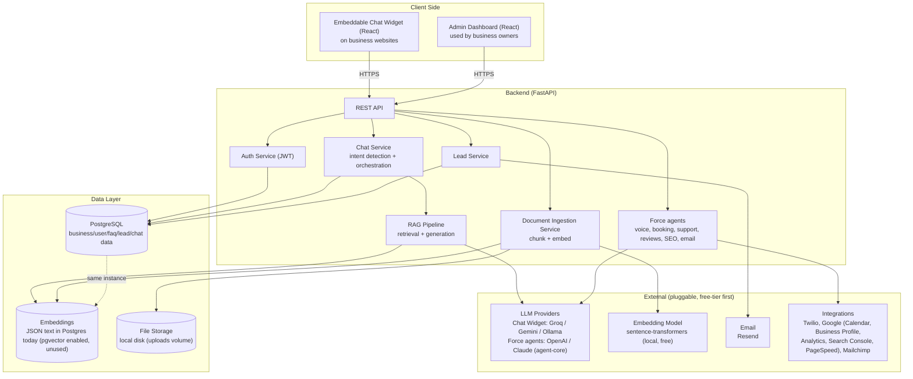

# Mielikkix — Architecture Document

## 1. System Overview

Multi-tenant SaaS. Each business ("tenant") has isolated data (FAQs, documents, leads, conversations) but shares the same application and infrastructure, distinguished by `business_id`.

```mermaid
graph TB
    subgraph "Client Side"
        W["Embeddable Chat Widget (React)<br/>on business websites"]
        D["Admin Dashboard (React)<br/>used by business owners"]
    end

    subgraph "Backend (FastAPI)"
        API["REST API"]
        AUTH["Auth Service (JWT)"]
        CHAT["Chat Service<br/>intent detection + orchestration"]
        RAG["RAG Pipeline<br/>retrieval + generation"]
        AGENTS["Force agents<br/>voice, booking, support, reviews, SEO, email"]
        LEAD["Lead Service"]
        DOC["Document Ingestion Service<br/>chunk + embed"]
    end

    subgraph "Data Layer"
        PG[("PostgreSQL<br/>business/user/faq/lead/chat data")]
        VEC[("Embeddings<br/>JSON text in Postgres today (pgvector enabled, unused)")]
        FS[("File Storage<br/>local disk (uploads volume)")]
    end

    subgraph "External (pluggable, free-tier first)"
        LLM["LLM Providers<br/>Chat Widget: Groq / Gemini / Ollama<br/>Force agents: OpenAI / Claude (agent-core)"]
        EMB["Embedding Model<br/>sentence-transformers (local, free)"]
        MAIL["Email<br/>Resend"]
        EXT["Integrations<br/>Twilio, Google (Calendar, Business Profile,<br/>Analytics, Search Console, PageSpeed), Mailchimp"]
    end

    W -->|"HTTPS"| API
    D -->|"HTTPS"| API
    API --> AUTH
    API --> CHAT
    API --> LEAD
    API --> DOC
    CHAT --> RAG
    RAG --> VEC
    RAG --> LLM
    DOC --> EMB
    DOC --> VEC
    DOC --> FS
    AUTH --> PG
    CHAT --> PG
    LEAD --> PG
    LEAD --> MAIL
    API --> AGENTS
    AGENTS --> LLM
    AGENTS --> EXT
    PG -.->|"same instance"| VEC
```

## 2. Components

### 2.1 Chat Widget (React, embeddable)
- Ships as a small standalone JS bundle loaded via `` — built by `apps/dashboard/` (`vite.widget.config.ts`) and served as a static file alongside the dashboard SPA, but its own runtime API calls target `api.mielikkix.ai` (see §5), not the host it was loaded from. (`apps/chat-widget/` is a README-only placeholder for a future extraction — there's no existing seam to cut the widget out along today, since it shares models/db/rag with the API.)
- Talks only to the public chat API (`/api/chat/*`) and `/api/businesses/{id}/public-settings` — no admin credentials.
- Renders in a Shadow DOM to avoid CSS collisions with the host site.

### 2.2 Admin Dashboard (React)
- Authenticated SPA for business owners, in English or Norwegian Bokmål (`apps/dashboard/src/shared/i18n`, choice stored on `users.locale` via `PATCH /api/auth/me/preferences`).
- Manages FAQs (with a knowledge-conflict check), documents, products/services, leads, conversations, analytics, plan/usage, and settings (appearance, personality, languages, booking calendar + opening hours, privacy, advanced).
- Agent modules (SEO, Reviews, Email Marketing) render only when `GET /api/businesses/me/agents` says the business has that agent (`AgentGate`); the API re-checks the same thing on every agent route.

### 2.3 Backend API (FastAPI)
- Stateless REST API, horizontally scalable.
- Routers: `auth`, `account`, `consent`, `businesses`, `websites`, `faqs`, `documents`, `products`, `chat`, `leads`, `analytics`, `admin`, `admin_articles`, `public_articles`, the Force agent routers (`agents_voice`, `agents_booking`, `agents_support`, `agents_reviews`, `agents_seo`, `agents_seo_audit`, `campaigns`), and the per-tenant OAuth routers (`calendar_oauth`, `review_oauth`, `google_oauth`, `mailchimp_oauth`).
- All authenticated routes resolve `business_id` from the JWT — never trust a client-supplied tenant ID for writes. The `admin` router is the one deliberate exception: it's platform-operator-only (see §2.7) and intentionally queries across every tenant.

### 2.4 RAG Pipeline (Python, `apps/api/app/rag/pipeline.py`)
1. Document uploaded → text extracted → chunked (`chunk_size`/`chunk_overlap` from settings).
2. Chunks embedded via `sentence-transformers` (local, free) and stored in `document_chunks.embedding_json` (a JSON-encoded float list), scoped by `business_id`.
3. On a chat message: embed the query (multilingual model, `paraphrase-multilingual-MiniLM-L12-v2`), pull every chunk, active FAQ and active product for that `business_id` (each has its own `embedding_json`) and score them with a pure-Python cosine-similarity loop (`_cosine_similarity` in `pipeline.py`) — **not a pgvector index query**, despite the `pgvector` extension being enabled on the `db` container. This is a known gap: fine at small per-tenant counts, but a brute-force scan that gets slower as a business's content grows.
   The reply language follows the visitor's message (`rag/language_detect.py`), within the business's configured `languages`. Shared AI safety rules (`mielikkix_agent_core.guardrails.AI_SAFETY_RULES`: untrusted context, never claim to be human, never reveal instructions, stay on topic) are appended to the system prompt.
4. Build a grounded prompt from whichever of {chunks above a confidence threshold, matched FAQs, matched products} are non-empty, call the LLM provider.
5. If nothing matches (empty context) → return the business's configured fallback message (or a default) instead of calling the LLM at all — this is the actual "fallback" path today, not a separate rule-based engine.

**Migrating to a real pgvector similarity query** (`ORDER BY embedding <=> query_embedding` with an ivfflat/HNSW index, on a native `VECTOR` column instead of `embedding_json` TEXT) is tracked as follow-up work, not yet done.

**Full-site import** (`POST /api/documents/from-website`, `apps/api/app/services/document_service.py`): given just a domain, discovers every page on that site and ingests each one through the same fetch→strip→chunk→embed pipeline as the single-page `/from-url` import (`ingest_url`), rather than requiring the owner to paste in one URL at a time.
- Discovery: tries `{domain}/sitemap.xml` first (following one level of `<sitemapindex>` nesting, up to 5 nested sitemaps), falls back to a same-domain link crawl (BFS, depth 2) if no sitemap exists — see `discover_website_pages`.
- Filtered by `robots.txt` (`_get_robot_parser`) and non-page file extensions (images, PDFs, etc.), then capped at `MAX_CRAWL_PAGES` (40) regardless of plan, and further trimmed to the business's remaining `max_document_uploads` allowance before anything is queued.
- Runs as a FastAPI `BackgroundTasks` job (`crawl_and_ingest_website`) so the request returns immediately with a discovered/queued count — pages appear on the Documents page one by one as they move `processing` → `embedded`. The background job opens its own DB session (`SessionLocal()`) since the request's injected session is already closed by the time it runs; one page failing to fetch doesn't abort the rest of the batch.
- Same SSRF guard (`_assert_public_url`) as the single-page import, applied to the entered domain and to every discovered link during a link-crawl fallback.

### 2.5 LLM Provider Abstraction
- Common interface (`generate(prompt, context) -> text`) with adapters for Groq, Google Gemini, local Ollama, OpenAI, Claude.
- Default to a free-tier provider; business/tenant config can override which provider/model to use.

### 2.6 Lead Capture
- Triggered by explicit form fill or detected "lead" intent mid-conversation.
- Stored in `leads` table; optionally emailed to the business via free-tier transactional email.

#### 2.6.1 Mailchimp Sync (marketing site only)
- The marketing site's own "Book a Free Demo" form (`website/src/pages/demo.astro`) posts to
  the exact same `POST /api/leads` every tenant's chat widget uses, using Mielikkix's own
  `business_id` (`PUBLIC_MIELIKKIX_BUSINESS_ID`). `app/services/lead_service.py` gates
  Mailchimp behavior to that ONE business_id (`MAILCHIMP_SYNC_BUSINESS_ID`) — no other
  tenant's own end-customer leads are ever sent to Mielikkix's Mailchimp audience.
- `LeadController` (`app/api/leads.py`) → `LeadService` (`app/services/lead_service.py`) →
  `MailchimpService` (`app/services/mailchimp_service.py`), the same layering idiom as
  `calendar_provider.py`/`review_platforms/`.
- Flow: validate → normalize email (lowercase) → find-or-create the Lead row (dedup by email,
  marketing business only) → save to DB → best-effort sync to Mailchimp as a background task
  (add/update contact + merge fields + tags) → DB save always succeeds even if Mailchimp is
  down or unconfigured (`mailchimp_synced` tracks the outcome; `POST /{id}/sync-mailchimp` is
  the manual retry).
- Consent: `marketing_consent` (separate from "requested a demo") is a one-way flag a
  later, unchecked resubmission can never downgrade back to false or erase the
  recorded `marketing_consent_at`. A newly-consenting contact is sent to Mailchimp as
  `status_if_new: "pending"` (never `"subscribed"` directly — that would bypass the
  audience's Double Opt-In), so Mailchimp itself sends and owns the confirmation email;
  only Mailchimp ever moves the contact to "Subscribed". A non-consenting contact is
  `"transactional"`. Neither path ever sends a bare `status` field, so an EXISTING
  contact's real status (in particular, anyone who previously unsubscribed) is never
  touched by this sync, no matter what a later submission's checkbox says.
- See `files/MAILCHIMP_SETUP.md` for the manual Mailchimp account setup this depends on,
  including how to verify Double Opt-In and unsubscribe-protection by hand.

#### 2.6.2 Email Marketing Agent — per-tenant Mailchimp OAuth
- A completely separate system from §2.6.1: a *tenant* connects their own Mailchimp account
  (not Mielikkix's own), gated by the `email_marketing` agent access
  (`services/agent_access_service.py`, §2.10). Routes live under `/api/businesses/me/mailchimp`
  (`apps/api/app/api/mailchimp_oauth.py`), following the same signed-`state`/tenant-resolution
  shape as `calendar_oauth.py`/`review_oauth.py`, but with genuinely different OAuth mechanics
  (no refresh token; an extra post-exchange metadata call to learn the account's data-center
  prefix) — see that file's own docstring for the specifics, verified against Mailchimp's OAuth
  guide rather than assumed from Google's shape.
- Flow: `GET /authorize` (302 to Mailchimp's consent screen) → `GET /callback` (exchanges
  `code`, fetches metadata, encrypts the token, upserts `MailchimpConnection`) → `GET /status` →
  `GET /audiences` + `POST /select-audience` (a separate step after connecting, since Mailchimp
  has no meaningful default audience) → `DELETE` to disconnect. Reconnecting overwrites the
  same row (unique `business_id`) rather than creating a duplicate.
- The connected account's token is stored encrypted (`MailchimpConnection.access_token_encrypted`,
  `apps/api/app/models/mailchimp_connection.py`) — see `files/DATABASE_SCHEMA.md`.
- `GET /audiences` is routed through the provider abstraction
  (`apps/api/app/integrations/email_marketing_providers/`, an ABC + `get_email_marketing_provider()`
  factory, same idiom as §2.5's LLM providers / `calendar_provider.py`) rather than calling
  `MailchimpClient` directly. `/authorize` and `/callback` are NOT — they're Mailchimp-specific
  OAuth handshake mechanics the abstraction deliberately doesn't cover (there's no connected
  account yet at that point). `resend` is listed as a future second provider but raises
  `NotImplementedError` — not built.
- **Campaigns** (`apps/api/app/api/campaigns.py` → `services/campaign_service.py`, `campaigns`
  table): draft locally → approve (local-only human-approval gate) → test send / send now /
  schedule, at which point the campaign is created on Mailchimp and Mailchimp delivers it.
  Mailchimp is the system of record after that: status is copied from Mailchimp and refreshed
  by polling when the report (`GET /{id}/report`, live Mailchimp `/reports`) is opened — no
  webhook, no local per-recipient send table. No AI copywriting yet.
  See `files/MAILCHIMP_OAUTH_SETUP.md` for the full per-tenant OAuth integration.

### 2.7 Platform Admin Dashboard (`/admin`, React)
- A private area of the same dashboard SPA, reserved for the Mielikkix operator (not a tenant/business role) — reachable at `/admin` alongside the existing `/dashboard` routes, gated by `RequireAdmin` in `apps/dashboard/src/App.tsx`.
- Identity: the `PLATFORM_ADMIN_EMAILS` env var (comma-separated) is checked against the logged-in user's email — see `require_platform_admin` in `apps/api/app/core/dependencies.py`. Not a DB column, since this is a deployment-level operator concept, not a per-tenant role; logging in still goes through the normal `/login` flow and JWT cookie.
- Shows: all registered businesses and their plan/status (`/admin/businesses`), a per-business drill-down (`/admin/businesses/{id}`, including per-agent on/off switches), a platform KPI overview (`/admin`), AI token usage (`/admin/usage`, §2.8), every booking (`/admin/bookings`), every Support Triage ticket (`/admin/tickets`), and the blog CMS (`/admin/articles`, §2.12).
- Every backend route lives under `/api/admin` and is protected once at the router level by `require_platform_admin`, so nothing added later can be left unprotected.
- **No self-serve path to a paid plan.** `PATCH /api/businesses/me/plan` (the business's own dashboard) only ever accepts `"free"` — any paid value is rejected with `403`, deliberately, because no payment processor is connected anywhere in the app (checkout is a simulated UI, see `files/FEATURES.md`). Without that check, anyone who skipped the UI and called the endpoint directly (curl/Postman/Swagger) could put their own business on Growth for free; that's a monetization gap, not something the dashboard's `PAYMENT_COMING_SOON` modal actually closes on its own, so the backend closes it instead.
- **Only a platform admin can set a paid plan** — `PATCH /api/admin/businesses/{id}/plan` (operator-only, any of `free`/`basic`/`business`/`growth`), exposed as a "Set plan…" control on the business detail page. This is the sole mechanism for putting a business on a paid tier until real billing exists: testing, demos, or manually activating a customer who paid through some other channel (e.g. a bank transfer, invoice).
- **Business status lifecycle** (`businesses.status`: `trial` / `active` / `suspended`) — mostly automatic, with one manual override:
  - Both plan-set paths auto-sync status: `"trial"` on Free, `"active"` on any paid plan — this is the only real "purchase" signal that exists today. The admin plan endpoint skips this sync if the business is currently `suspended`, so changing a suspended business's plan doesn't silently reactivate it.
  - The business detail page's **Suspend**/**Reactivate** buttons call `PATCH /api/admin/businesses/{id}/status` (operator-only). Suspending also force-downgrades the business to Free — standing in for what a real failed/cancelled-payment webhook would do once billing is actually wired up. Reactivating only flips status back; it does not restore whatever plan the business was on before.

### 2.8 LLM Usage Tracking
- Token usage is recorded per LLM call into `llm_usage_logs` (see `files/DATABASE_SCHEMA.md`). Two paths feed it:
  - Chat Widget on Groq: `GroqProvider._record_usage` in `apps/api/app/rag/providers/groq_provider.py`.
  - Every Force agent call (OpenAI/Anthropic/Groq via agent-core's `LLMClient`): `set_usage_hook` (agent-core 0.2.0) reports each call to `apps/api/app/core/llm_usage.py`, tagged by feature (`usage_tag`: `voice`, `booking`, `support_triage`, `reviews`, `seo_*`). `run_rag` (`apps/api/app/rag/pipeline.py`) and the fallback-message translation flow (`apps/api/app/api/businesses.py`) both call the shared `log_llm_usage`/`_fill_default_fallback_translations` logging path; rows are staged with `db.add` and committed in the same transaction as the chat message or settings update they belong to, not separately.
- The Chat Widget's Gemini and Ollama providers aren't instrumented — a business on those shows no chat usage on `/admin/usage`.

### 2.9 Plan Service (`apps/api/app/services/plan_service.py` + `apps/api/app/core/plans.py`)
- `apps/api/app/core/plans.py` is the single source of truth for the four Chat Widget plans (keys `free`/`basic`/`business`/`growth`, shown as Free/Start/Business/Growth, fixed NOK prices) — limits and feature flags as plain dataclasses, nothing hardcoded elsewhere. `docs/pricing-rules.md` has the rules.
- `plan_service` answers "is business X allowed to do Y right now": usage counting (websites, conversations this month, documents, products), limit checks (raise `402` when a cap is hit), and feature gating (raise `403` if a plan doesn't include a feature, `501` if the plan includes it but it isn't actually built yet — see `NOT_YET_IMPLEMENTED_FEATURES`).
- Conversations are a **soft limit**: `check_conversation_limit` allows 10% grace over the quota; `claim_quota_warning` + `notify_quota_warning` email the owner once at 80% and once at 100% per month (`businesses.quota_warning_month/level`).
- Routers call these helpers rather than re-deriving limits themselves, so a plan change in `plans.py` takes effect everywhere at once.
- Plan selection is on the dashboard (`PlanPage.tsx`); paid plans show a "payment coming soon" message — no payment processor is wired up (see `files/FEATURES.md`).

### 2.10 Force agents and agent access
- Agent catalog and prices: `apps/api/app/core/agent_catalog.py` (`AGENTS`, incl. the SEO free/Start tiers and 3-pack / Full Crew bundle prices).
- Access is per business, in the `business_agent_access` table, switched on/off by a platform admin (`PATCH /api/admin/businesses/{id}/agents/{agent_key}`). `services/agent_access_service.py` (`has_agent_access` / `require_agent_access`) is the one check every agent route uses; the dashboard reads the same data via `GET /api/businesses/me/agents`. (The root `CLAUDE.md` names `packages/billing` as the eventual home for this; that package is still a scaffold.)
- Agent code lives in `apps/api` (routers `api/agents_*.py`, logic in `services/`); the `apps/agents/<name>/CLAUDE.md` files are each agent's spec and status.
- Agent-to-agent handoffs are direct function calls in the same process: Voice → `booking_service` / `support_service.create_ticket`; Support Triage and the Chat Widget → the Booking Assistant flow (`suggest_booking_flow`).
- Per-tenant third-party connections, each an OAuth flow with a signed `state` and an encrypted token: Google Calendar (`calendar_connections`), Google Business Profile (`review_connections`), Google Analytics/Search Console (`seo_google_connections`), Mailchimp (`mailchimp_connections`).
- SEO recurring audits run on an in-process APScheduler tick (`services/seo_schedule_service.py`, started in `main.py`'s lifespan); audits and website crawls run as FastAPI `BackgroundTasks`. There is no general job queue yet.

### 2.11 Privacy / GDPR
- Sign-up records consent (`consent_records`: type, document version from `core/legal.py`, source, hashed IP) plus `users.country` and an optional marketing opt-in.
- Account self-service (`/api/account`): privacy status, marketing consent, re-accepting updated terms, full data export, and account deletion with a grace period (`businesses.deletion_requested_at/deletion_scheduled_for`) that can be cancelled.
- End-visitor data: per-business `conversation_retention_days` enforced by `services/retention_service.py`; `POST /api/chat/visitors/erase` erases one visitor's conversations and leads; optional pre-chat consent screen (`require_chat_consent`) and an always-on AI notice in the widget.
- `GET/POST /api/consent/unsubscribe` — one-click unsubscribe for marketing emails.
- `core/log_redaction.py` masks emails/phone numbers in logged third-party errors.
- Internal records live in `docs/privacy/`; the plan is `GDPR-COMPLIANCE-CLAUDE.md`.

### 2.12 Articles (blog CMS) and website publishing
- Platform admins write articles at `/admin/articles` (`api/admin_articles.py` → `services/article_service.py`; HTML sanitized with `bleach`). The marketing site reads published ones from `GET /api/public/articles` at `astro build` time.
- Publish/unpublish triggers `services/deploy_service.py` as a background task: build `website/` and upload `dist/` to Hostinger over SFTP (`paramiko`), recording `deployment_status` / `last_deployment_error` on the article. If `WEBSITE_REPO_PATH` or the `WEBSITE_DEPLOY_SFTP_*` settings are missing it reports a real failure, never a fake "live".

## 3. Multi-Tenancy Approach

- **Shared database, shared schema, tenant column** (`business_id` on every tenant-scoped table) — simplest and cheapest for MVP; can graduate to schema-per-tenant later if a client needs stronger isolation.
- Row-level filtering enforced in the service layer (and optionally Postgres Row-Level Security later).

## 4. API Endpoints (as implemented — see `apps/api/app/api/*.py` for exact request/response shapes)

### Auth (`/api/auth`) — public
- `POST /register` — create business + owner account (with consent, country, marketing opt-in), sets the auth cookie
- `POST /login` — sets the auth cookie
- `GET /me` — current user (incl. `is_platform_admin`, `locale`)
- `PATCH /me/preferences` — UI language (`en`/`nb`)
- `POST /logout`
- `POST /forgot-password` — always returns the same message whether or not the email exists (no account enumeration); rate-limited 5/hour
- `POST /reset-password` — consumes a one-time token; rate-limited 10/hour

### Business / Admin (`/api/businesses`)
- `GET /{business_id}/public-settings` — public, widget-facing: welcome message + primary color only
- `GET /me`, `PATCH /me` — branding/profile (custom `primary_color` is plan-gated, 403 if not entitled)
- `GET /me/settings`, `PATCH /me/settings` — tone, welcome/fallback message, hours, contact info, languages (plan-gated count), LLM provider/model
- `GET /plans` — public plan catalog (pricing page / upgrade UI)
- `GET /me/plan` — current plan + live usage + resolved feature flags
- `PATCH /me/plan` — self-serve, **Free-only**: `403` on any paid plan value, since no payment processor exists (see `files/FEATURES.md` and §2.7). Switching to Free auto-syncs `status` to `"trial"`.
- `PATCH /me/plan/api-access-addon` — API access add-on toggle; currently rejected on every plan (`api_access_addon_available` is false everywhere — API access is Growth-only)
- `GET /me/api-key`, `POST /me/api-key`, `DELETE /me/api-key` — API key issuance/revocation (gated by `api_access` feature)
- `GET /agents` — public agent catalog (prices, SEO tiers)
- `GET /me/agents` — `{agent_key: bool}` for this business
- `POST /me/notification-channels` — enable WhatsApp/Instagram; currently always 501s (not built yet), by design

### Websites (`/api/websites`) — the domains a business runs its widget on, capped by plan
- `GET ""`, `POST ""`, `DELETE /{id}`

### FAQs (`/api/faqs`)
- `GET ""`, `POST ""`, `PATCH /{id}`, `DELETE /{id}`
- `GET /issues` — possible contradictions in the knowledge base (`services/knowledge_check_service.py`)

### Documents / knowledge base (`/api/documents`)
- `GET ""`, `POST ""` — file upload, triggers chunk+embed
- `POST /from-url` — fetch and ingest a single web page directly (SSRF-guarded — rejects internal/private addresses)
- `POST /from-website` — discover and ingest every page on a domain (sitemap → link-crawl fallback → robots.txt filter → plan-cap trim), queued as a background job — see §2.4
- `POST /{id}/refetch` — re-import a URL-sourced document
- `DELETE /{id}`

### Products/Services (`/api/products`)
- `GET ""`, `POST ""`, `PATCH /{id}`, `DELETE /{id}`

### Chat (`/api/chat`) — public, widget-facing except where noted
- `POST /message` — `{business_id, session_id, message}` → AI/fallback response, rate-limited
- `GET /conversations` — **authenticated** (dashboard), lists this business's sessions with nested messages
- `PATCH /conversations/{id}` — **authenticated**, close/reopen
- `DELETE /conversations/{id}` — **authenticated**
- `POST /test` — **authenticated**, "Test your chatbot" (real pipeline, no conversation/lead/quota)
- `POST /visitors/erase` — **authenticated**, erase one visitor's data (§2.11)
- `GET /history/{session_id}`

### Leads (`/api/leads`)
- `GET ""` — authenticated
- `POST ""` — public (widget submits directly), rate-limited. Returns `{success, message}`,
  never the raw lead row. Shared by every tenant's own chat widget AND the marketing site's
  own "Book a Free Demo" form (`website/src/pages/demo.astro`) — see §2.6 and
  `files/MAILCHIMP_SETUP.md` for how the latter's leads get synced to Mailchimp.
- `PATCH /{id}` — authenticated, status update (new/contacted/won/lost)
- `POST /{id}/sync-mailchimp` — authenticated, manual retry of a lead's Mailchimp sync
  (see §2.6.1)

### Email Marketing — Mailchimp OAuth (`/api/businesses/me/mailchimp`) — authenticated, see §2.6.2
- `GET /authorize` — 302 redirect to Mailchimp's OAuth consent screen; `403` if the business's
  business doesn't have the `email_marketing` agent, `503` if OAuth isn't configured server-side
- `GET /callback` — public (Mailchimp redirects the browser here with `code`/`state`), not tenant-authenticated by cookie
- `GET /status` — `{connected, configured, account_name?, login_email?, audience_id?, audience_name?, connected_at?}`
- `GET /audiences` — live Mailchimp `GET /lists` call via the connected account; `404` if not connected yet
- `POST /select-audience` — `{audience_id, name}`, persists/overwrites the chosen audience; `404` if not connected yet
- `DELETE ""` — disconnects (deletes the tenant's `MailchimpConnection` row)

### Email Marketing — campaigns (`/api/businesses/me/campaigns`) — authenticated, agent-gated, see §2.6.2
- `GET ""`, `POST ""`, `GET /{id}`, `PATCH /{id}`
- `POST /{id}/approve`, `POST /{id}/test`, `POST /{id}/send`, `POST /{id}/schedule`
- `GET /{id}/report` — live Mailchimp report; also refreshes status

### Booking Assistant (`/api/agents/booking`) — public, rate-limited, business-scoped
- `POST /request` — free text → open slots (or a clarifying question)
- `POST /confirm` — re-check availability, create the Google Calendar event, notify
- `GET /dev/busy` — DEBUG-only

### Booking calendar OAuth (`/api/businesses/me/calendar`) — authenticated
- `GET /authorize`, `GET /callback` (public), `GET /status`, `DELETE ""`

### Voice Receptionist (`/api/agents/voice`)
- `POST /incoming`, `POST /gather` — Twilio webhooks (signature-validated)
- `POST /dev/start`, `POST /dev/gather` — browser demo (gated by demo access)
- `GET /dev/voice-test` — DEBUG-only

### Support Triage (`/api/agents/support`) — origin-restricted CORS
- `POST /chat/message` — classify, answer or escalate, may suggest the booking flow
- `POST /chat/contact` — visitor leaves an email after an escalation

### Review & Reputation (`/api/agents/reviews`) — authenticated, agent-gated
- `GET ""`, `POST ""`, `POST /import`, `DELETE /samples`
- `POST /analyze-pending`, `POST /{id}/analyze`, `POST /{id}/generate-response`, `PATCH /{id}/response`
- `POST /{id}/approve`, `POST /{id}/reject`, `POST /{id}/publish` (posts the approved reply to Google), `POST /{id}/escalate`
- `GET /insights`, `GET /trends`, `POST /chat`
- `POST /demo` — public website demo

### Review platform OAuth (`/api/businesses/me/reviews`) — authenticated
- `GET /authorize`, `GET /callback` (public), `GET /status`, `GET /locations`, `POST /select-location`, `DELETE ""`

### SEO Audit & Optimize — authenticated, agent-gated
- `/api/agents/seo/websites`: `POST ""`, `GET ""`, `GET /{id}`, `DELETE /{id}`, `PATCH /{id}/schedule`, `POST /{id}/audits`, `GET /{id}/audits`
- `/api/agents/seo/audits/{audit_id}`: `GET ""`, `GET /pages`, `GET /performance`, `GET /findings`, `GET /action-plan`, `GET /keyword-opportunities`, `GET /compare`, `GET /report`
- `/api/agents/seo/findings/{finding_id}`: `PATCH ""`, `GET /drafts`, `POST /generate-draft`
- `/api/agents/seo/drafts`: `POST /generate` (bulk product copy), `GET ""`, `POST /{id}/approve`, `POST /{id}/reject`

### SEO Google OAuth (`/api/businesses/me/google`) — authenticated, Start tier
- `GET /authorize`, `GET /callback` (public), `GET /status`, `PATCH /config` (pick GA property / Search Console site), `DELETE ""`

### Account / privacy (`/api/account`) — authenticated, see §2.11
- `GET /privacy`, `PUT /marketing`, `POST /consents/accept`, `GET /export`, `POST /deletion`, `DELETE /deletion`

### Consent (`/api/consent`) — public
- `GET /unsubscribe`, `POST /unsubscribe`

### Articles
- `/api/admin/articles` (operator-only): `GET ""`, `GET /{id}`, `POST ""`, `PATCH /{id}`, `DELETE /{id}`, `POST /{id}/publish`, `POST /{id}/unpublish`, `POST /{id}/deployment-result`
- `/api/public/articles` (public): `GET ""`, `GET /{slug}`

### Analytics (`/api/analytics`)
- `GET /summary` — conversation/lead/message counts + top questions; field set varies by plan's `analytics_tier` (basic/standard/advanced)

### Platform Admin (`/api/admin`) — operator-only, see §2.7/§2.8
- `GET /overview` — platform KPIs: total businesses, breakdown by plan/status, signups over the last 30 days, totals for conversations/leads/documents
- `GET /businesses` — paginated, filterable (`q`, `plan`, `status`) list of every registered business + owner + plan + usage counts
- `GET /businesses/{business_id}` — full detail for one business: profile, owners, plan/limits/usage, settings snapshot, resource counts, 30-day Groq usage summary
- `PATCH /businesses/{business_id}/plan` — set any plan (`free`/`basic`/`business`/`growth`); the only way to reach a paid plan today (see §2.7). Auto-syncs `status`, skipped if the business is currently suspended.
- `PATCH /businesses/{business_id}/status` — manual `active`/`suspended` override (see §2.7); suspending also forces `plan = "free"`
- `PATCH /businesses/{business_id}/agents/{agent_key}` — switch a Force agent on/off for a business (§2.10)
- `GET /llm-usage` — token usage totals (all logged providers), a daily series, and a top-businesses-by-tokens breakdown (`business_id`, `days` query params)
- `GET /bookings` — every booking
- `GET /tickets`, `GET /tickets/{ticket_id}` — Support Triage tickets and their messages

## 5. Deployment Topology

Domain: **mielikkix.ai**, registered on Hostinger. Marketing site, dashboard, and API are three separate hosts under that one domain — the dashboard and API used to share a single `app.*` host (with the dashboard's nginx proxying `/api/*` to the API), but they're now split so the API has its own subdomain instead of riding behind the dashboard's reverse proxy:

- **Marketing site** (`website/`, static Astro build) → `mielikkix.ai`, served from Hostinger **shared hosting** (`public_html`) — the plan already in place for the domain. No server process, so shared hosting's file-serving-only model is sufficient.
- **Dashboard** (`apps/dashboard/`) → `app.mielikkix.ai`, a static SPA build served by its own `nginx` container (`apps/dashboard/nginx.conf`, no `/api/*` proxy block anymore). The dashboard's axios client (`apps/dashboard/src/shared/api/client.ts`) calls `https://api.mielikkix.ai` directly in production; in dev, Vite's own dev-server proxy (`vite.config.ts`) still forwards `/api` to `localhost:8000`, unchanged.
- **API** (`apps/api/` + `db`) → `api.mielikkix.ai`, served from a **Hostinger VPS** (2 vCPU / 8 GB — see the root `CLAUDE.md`) running `docker compose up -d --build`. Shared hosting can't run a persistent uvicorn process or self-hosted Postgres, hence the separate VPS.
  - DNS: `A`/`CNAME` records for `app` and `api` pointing at wherever each is actually hosted — no path-based split (`/app`, `/api`) needed since they're fully separate hosts now.
  - `CORS_ORIGINS` in production `.env` must include `https://app.mielikkix.ai` (with `allow_credentials=True` in `main.py`'s `CORSMiddleware`) so the browser accepts cross-origin requests from the dashboard. The httpOnly auth cookie (`SameSite=Lax`, set on `api.mielikkix.ai`) still reaches those requests despite the cross-*origin* call, because `app.mielikkix.ai` and `api.mielikkix.ai` share the same registrable domain (`mielikkix.ai`) and SameSite only cares about that, not the full origin.
  - TLS is terminated by a reverse proxy on the VPS, outside this repo; the containers themselves listen on plain HTTP (`nginx.conf` on :80, uvicorn on :8000 with `--proxy-headers` so OAuth redirect URLs come out as `https://`).
- **Database**: PostgreSQL + pgvector, self-hosted via the `db` service on the same VPS (not a managed free-tier instance) — see §2.4 above for the caveat that pgvector's actual vector-search capability isn't used by the current retrieval code yet.
- **CI/CD**: GitHub Actions (`.github/workflows/ci.yml`) runs API tests + migration check and builds the dashboard + chat-widget bundle on push/PR. Actual deploys are still manual (`git pull` + `docker compose up -d --build` on the VPS) — CI doesn't deploy yet. The marketing site is uploaded to Hostinger by hand or by the admin Articles publish flow (§2.12).
- **Secrets**: a single `.env` at the repo root (git-ignored), read by `apps/api/app/core/config.py` regardless of which directory the process is started from.

## 6. Security Notes

- JWT auth in an httpOnly cookie, hashed passwords (`passlib` bcrypt).
- Third-party OAuth tokens encrypted at rest (`core/encryption.py`, Fernet).
- Twilio webhook signatures validated; agent `/dev/*` routes gated.
- Shared AI safety rules on every customer-facing prompt (§2.4).
- Public endpoints (`/api/chat/message`, `/api/leads`, auth, agent demo/booking routes) are rate-limited (`slowapi`) to prevent abuse/cost overrun on LLM calls.
- Validate and sandbox uploaded documents (file type/size limits) before parsing.
- CORS restricted to registered business domains for widget embeds where feasible.
