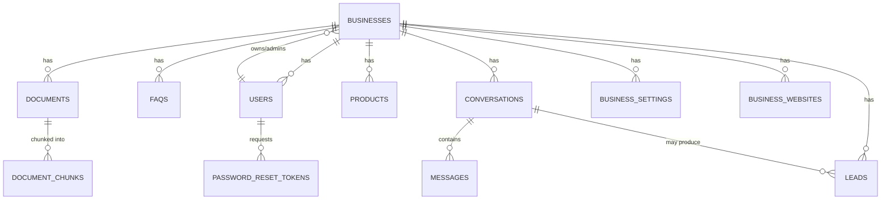

# MielikkiX — Database Schema (PostgreSQL + pgvector)

## Conventions
- Every tenant-scoped table has a `business_id UUID` foreign key, indexed.
- All tables have `id UUID PRIMARY KEY DEFAULT gen_random_uuid()`, `created_at`, `updated_at`.
- `pgvector` extension enabled: `CREATE EXTENSION IF NOT EXISTS vector;`

## Entity Overview

## Tables

### `businesses`
| Column | Type | Notes |
|---|---|---|
| id | UUID PK | |
| name | TEXT | |
| slug | TEXT UNIQUE | used in embed script / subdomain |
| industry | TEXT | retail, restaurant, clinic, real_estate, service, other |
| logo_url | TEXT | nullable |
| primary_color | TEXT | for widget theming; default `#ff6b00`, custom values gated by plan |
| plan | TEXT | free / basic / business / growth (see `apps/api/app/core/plans.py`); self-serve can only ever set this to `free` — no payment processor exists, so only a platform admin can put a business on a paid plan |
| status | TEXT | active / trial / suspended — auto-synced whenever `plan` changes (Free → trial, any paid plan → active), via either the self-serve `PATCH /api/businesses/me/plan` (Free-only, see below) or the admin-only `PATCH /api/admin/businesses/{id}/plan` (the only way to reach a paid plan). Also manually overridable by a platform admin via `PATCH /api/admin/businesses/{id}/status`; suspending forces `plan` back to `free`. See `files/ARCHITECTURE.md` §2.7. |
| api_access_addon | BOOLEAN | Business-tier "+$12/mo API access" toggle; irrelevant on other plans |
| api_key | TEXT | nullable; issued/revoked via `/api/businesses/me/api-key`, gated by the `api_access` feature |
| created_at | TIMESTAMPTZ | |
| updated_at | TIMESTAMPTZ | |

### `users`
| Column | Type | Notes |
|---|---|---|
| id | UUID PK | |
| business_id | UUID FK → businesses.id | owner/admin's primary business |
| email | TEXT UNIQUE | |
| hashed_password | TEXT | |
| full_name | TEXT | |
| role | TEXT | owner / staff |
| is_active | BOOLEAN | |
| created_at | TIMESTAMPTZ | |

### `business_settings`
| Column | Type | Notes |
|---|---|---|
| id | UUID PK | |
| business_id | UUID FK, UNIQUE | 1:1 with businesses |
| tone | TEXT | friendly / formal / concise / playful |
| welcome_message | TEXT | |
| fallback_message | TEXT | shown when AI is unsure |
| business_hours | JSONB | e.g. `{ "mon": "9-18", ... }` |
| contact_email | TEXT | |
| contact_phone | TEXT | |
| languages | TEXT[] | e.g. `{en}`, later `{en,th,hi}` |
| llm_provider | TEXT | groq / gemini / ollama / openai / claude |
| llm_model | TEXT | provider-specific model name |

### `faqs`
| Column | Type | Notes |
|---|---|---|
| id | UUID PK | |
| business_id | UUID FK | indexed |
| question | TEXT | |
| answer | TEXT | |
| category | TEXT | nullable |
| is_active | BOOLEAN | |
| created_at | TIMESTAMPTZ | |
| updated_at | TIMESTAMPTZ | |

### `documents`
| Column | Type | Notes |
|---|---|---|
| id | UUID PK | |
| business_id | UUID FK | indexed |
| filename | TEXT | |
| file_url | TEXT | storage path/URL |
| file_type | TEXT | pdf / docx / txt / csv |
| status | TEXT | pending / processing / embedded / failed |
| uploaded_by | UUID FK → users.id | |
| created_at | TIMESTAMPTZ | |

### `document_chunks`
| Column | Type | Notes |
|---|---|---|
| id | UUID PK | |
| business_id | UUID FK | indexed — critical for scoped retrieval |
| document_id | UUID FK → documents.id | |
| chunk_index | INTEGER | order within document |
| content | TEXT | chunk text |
| embedding_json | TEXT | nullable — a JSON-encoded float list (e.g. 384-dim for MiniLM), **not** a native pgvector `VECTOR` column as originally planned |
| created_at | TIMESTAMPTZ | |

> **Drift from the original design**: this table was meant to use a native pgvector `VECTOR` column with an ivfflat index for similarity search. As actually implemented, `embedding_json` is plain `TEXT`, and retrieval (`apps/api/app/rag/pipeline.py`) pulls every chunk for a `business_id` and scores them with a Python cosine-similarity loop — no pgvector index query happens anywhere yet, even though the `pgvector` extension is enabled on the `db` container. Migrating to a real `VECTOR` column + ivfflat/HNSW index is tracked as follow-up work, not done. See `files/ARCHITECTURE.md` §2.4.

### `business_websites`
| Column | Type | Notes |
|---|---|---|
| id | UUID PK | |
| business_id | UUID FK | indexed |
| domain | TEXT | the domain this business runs its widget on |
| label | TEXT | nullable, human-readable name |
| created_at | TIMESTAMPTZ | |

Count against a business is capped by plan (`apps/api/app/core/plans.py`'s `max_websites`: 1 on Free/Basic, 3 on Business, 10 on Growth), enforced in `plan_service.check_website_limit`. No `updated_at` — rows are only ever created or deleted, never edited.

### `password_reset_tokens`
| Column | Type | Notes |
|---|---|---|
| id | UUID PK | |
| user_id | UUID FK → users.id | |
| token_hash | TEXT | unique — only the hash is stored; the raw token is emailed and never persisted, so a DB read alone can't yield a usable reset link |
| expires_at | TIMESTAMPTZ | tokens are valid for 1 hour from issuance |
| used_at | TIMESTAMPTZ | nullable — set once the token is consumed, preventing reuse |
| created_at | TIMESTAMPTZ | |

### `products` (products or services)
| Column | Type | Notes |
|---|---|---|
| id | UUID PK | |
| business_id | UUID FK | indexed |
| name | TEXT | |
| description | TEXT | |
| price | NUMERIC | nullable |
| currency | TEXT | default 'USD' |
| image_url | TEXT | nullable |
| category | TEXT | nullable |
| is_active | BOOLEAN | |
| created_at | TIMESTAMPTZ | |

### `conversations`
| Column | Type | Notes |
|---|---|---|
| id | UUID PK | |
| business_id | UUID FK | indexed |
| session_id | TEXT | widget-generated, groups messages per visitor session |
| visitor_id | TEXT | nullable, for returning-visitor tracking (cookie/local id) |
| channel | TEXT | website_widget / (future: whatsapp, fb) |
| status | TEXT | open / closed / handed_off |
| started_at | TIMESTAMPTZ | |
| ended_at | TIMESTAMPTZ | nullable |

### `messages`
| Column | Type | Notes |
|---|---|---|
| id | UUID PK | |
| conversation_id | UUID FK → conversations.id | indexed |
| sender | TEXT | visitor / ai / human_agent |
| content | TEXT | |
| intent | TEXT | nullable — faq / lead / product_inquiry / support / other |
| confidence | FLOAT | nullable — retrieval/generation confidence score |
| created_at | TIMESTAMPTZ | |

### `leads`
| Column | Type | Notes |
|---|---|---|
| id | UUID PK | |
| business_id | UUID FK | indexed |
| conversation_id | UUID FK → conversations.id | nullable |
| name | TEXT | |
| email | TEXT | nullable |
| phone | TEXT | nullable |
| message | TEXT | nullable |
| status | TEXT | new / contacted / won / lost |
| created_at | TIMESTAMPTZ | |

### `llm_usage_logs`
| Column | Type | Notes |
|---|---|---|
| id | UUID PK | |
| business_id | UUID FK | indexed |
| provider | TEXT | `groq` today — the only provider that records usage (see `apps/api/app/rag/providers/groq_provider.py`) |
| model | TEXT | nullable |
| kind | TEXT | `chat` (a visitor message answered via `run_rag`) or `translate` (fallback-message translation, see `apps/api/app/api/businesses.py`) |
| prompt_tokens | INTEGER | |
| completion_tokens | INTEGER | |
| total_tokens | INTEGER | |
| created_at | TIMESTAMPTZ | indexed |

One row per LLM API call, written in the same transaction as the chat message/settings update it belongs to. Powers the platform-admin Groq usage page (`GET /api/admin/llm-usage`) — see `files/ARCHITECTURE.md` §2.8.

## Notes on Vector Storage

- The plan is to keep vectors inside the same PostgreSQL instance via `pgvector` (instead of a separate paid vector DB like Pinecone) — free, simple for MVP scale, and keeps tenant isolation consistent with the rest of the schema (`business_id` on `document_chunks`). **Not yet true in practice** — see the drift note under `document_chunks` above; today it's a plain-text JSON column scanned in Python, not a pgvector query.
- If a client later needs very large-scale or very low-latency retrieval, `document_chunks` can be migrated to a dedicated vector store without changing the rest of the schema.

## Migrations

Managed with Alembic (`apps/api/alembic/`). Every schema change ships as a migration; `files/DATABASE_SCHEMA.md` should be updated in the same PR.
