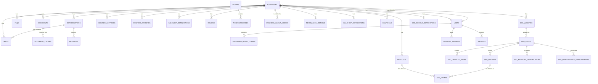

# Mielikkix — Database Schema (PostgreSQL + pgvector)

## Conventions
- Every tenant-scoped table has a `business_id UUID` foreign key, indexed.
- All tables have `id UUID PRIMARY KEY DEFAULT gen_random_uuid()`, `created_at`, `updated_at`.
- `pgvector` extension enabled: `CREATE EXTENSION IF NOT EXISTS vector;`

## Entity Overview

```mermaid
erDiagram
    BUSINESSES ||--o{ USERS : "has"
    BUSINESSES ||--o{ FAQS : "has"
    BUSINESSES ||--o{ DOCUMENTS : "has"
    BUSINESSES ||--o{ PRODUCTS : "has"
    BUSINESSES ||--o{ CONVERSATIONS : "has"
    BUSINESSES ||--o{ LEADS : "has"
    BUSINESSES ||--o{ BUSINESS_SETTINGS : "has"
    BUSINESSES ||--o{ BUSINESS_WEBSITES : "has"
    DOCUMENTS ||--o{ DOCUMENT_CHUNKS : "chunked into"
    CONVERSATIONS ||--o{ MESSAGES : "contains"
    CONVERSATIONS ||--o{ LEADS : "may produce"
    USERS ||--o{ BUSINESSES : "owns/admins"
    USERS ||--o{ PASSWORD_RESET_TOKENS : "requests"
    BUSINESSES ||--o{ CALENDAR_CONNECTIONS : "has"
    BUSINESSES ||--o{ REVIEWS : "has"
    PRODUCTS ||--o{ SEO_DRAFTS : "has draft for"
    TICKETS ||--o{ TICKET_MESSAGES : "contains"
    BUSINESSES ||--o{ BUSINESS_AGENT_ACCESS : "is entitled to"
    BUSINESSES ||--o| REVIEW_CONNECTIONS : "has"
    BUSINESSES ||--o| MAILCHIMP_CONNECTIONS : "has"
    BUSINESSES ||--o{ CAMPAIGNS : "has"
    BUSINESSES ||--o{ SEO_WEBSITES : "has"
    BUSINESSES ||--o| SEO_GOOGLE_CONNECTIONS : "has"
    SEO_WEBSITES ||--o{ SEO_AUDITS : "audited by"
    SEO_AUDITS ||--o{ SEO_CRAWLED_PAGES : "crawled"
    SEO_AUDITS ||--o{ SEO_FINDINGS : "found"
    SEO_AUDITS ||--o{ SEO_KEYWORD_OPPORTUNITIES : "suggests"
    SEO_AUDITS ||--o{ SEO_PERFORMANCE_MEASUREMENTS : "measured"
    SEO_FINDINGS ||--o{ SEO_DRAFTS : "fix drafted as"
    USERS ||--o{ CONSENT_RECORDS : "gave"
    USERS ||--o{ ARTICLES : "authors"
```

> Force-agent tables, the SEO audit tables, privacy and CMS tables are listed
> in their own sections below — they follow the same conventions but weren't
> part of the original MVP schema this diagram was first drawn for.
> *Last checked against `apps/api/app/models/` on 2026-10-07.*

## Tables

### `businesses`
| Column | Type | Notes |
|---|---|---|
| id | UUID PK | |
| name | TEXT | |
| slug | TEXT UNIQUE | used in embed script / subdomain |
| industry | TEXT | retail, restaurant, clinic, real_estate, service, other |
| logo_url | TEXT | nullable |
| primary_color | TEXT | for widget theming; default `#ff6b00`, custom values gated by plan |
| plan | TEXT | free / basic / business / growth — `basic` is displayed as "Start" (see `apps/api/app/core/plans.py`); self-serve can only ever set this to `free` — no payment processor exists, so only a platform admin can put a business on a paid plan |
| status | TEXT | active / trial / suspended — auto-synced whenever `plan` changes (Free → trial, any paid plan → active), via either the self-serve `PATCH /api/businesses/me/plan` (Free-only, see below) or the admin-only `PATCH /api/admin/businesses/{id}/plan` (the only way to reach a paid plan). Also manually overridable by a platform admin via `PATCH /api/admin/businesses/{id}/status`; suspending forces `plan` back to `free`. See `files/ARCHITECTURE.md` §2.7. |
| api_access_addon | BOOLEAN | legacy API-access add-on toggle; no plan currently allows it (`api_access_addon_available` is false everywhere) |
| api_key | TEXT | nullable; issued/revoked via `/api/businesses/me/api-key`, gated by the `api_access` feature (Growth) |
| seo_website_limit_override | INTEGER | nullable — per-business override of `DEFAULT_SEO_WEBSITE_LIMIT` (agent_catalog.py) |
| quota_warning_month | TEXT | nullable — `YYYY-MM` of the last conversation-quota warning email |
| quota_warning_level | INTEGER | 0 / 80 / 100 — highest warning already sent that month (soft limit, see `plan_service.claim_quota_warning`) |
| deletion_requested_at | TIMESTAMPTZ | nullable — account deletion requested (GDPR self-service) |
| deletion_scheduled_for | TIMESTAMPTZ | nullable, indexed — when the deletion runs; cancelling clears both |
| created_at | TIMESTAMPTZ | |
| updated_at | TIMESTAMPTZ | |

### `users`
| Column | Type | Notes |
|---|---|---|
| id | UUID PK | |
| business_id | UUID FK → businesses.id | owner/admin's primary business |
| email | TEXT UNIQUE | |
| hashed_password | TEXT | |
| full_name | TEXT | |
| role | TEXT | owner / staff |
| country | TEXT | nullable — ISO 3166-1 alpha-2, from the Register form (`core/countries.py`) |
| locale | TEXT | nullable — dashboard + email language, `en` / `nb`; null = English (`core/locale.py`) |
| is_active | BOOLEAN | |
| created_at | TIMESTAMPTZ | |

### `business_settings`
| Column | Type | Notes |
|---|---|---|
| id | UUID PK | |
| business_id | UUID FK, UNIQUE | 1:1 with businesses |
| tone | TEXT | friendly / formal / concise / playful |
| welcome_message | TEXT | default-language greeting |
| welcome_messages | JSON | per-language greetings, `{ "nb": "...", ... }` |
| fallback_message | TEXT | shown when AI is unsure |
| fallback_messages | JSON | per-language fallbacks (auto-translated) |
| business_hours | JSON | per weekday open/close; also the Booking Assistant's bookable hours |
| contact_email | TEXT | |
| contact_phone | TEXT | |
| languages | JSON | list of ISO codes, e.g. `["en", "nb"]`; count capped by plan `max_languages` |
| llm_provider | TEXT | groq (default) / gemini / ollama |
| llm_model | TEXT | nullable, provider-specific model name |
| privacy_policy_url | TEXT | nullable — linked from the widget's AI notice / consent screen |
| conversation_retention_days | INTEGER | default 90 — visitor conversations older than this are deleted (`retention_service.py`) |
| require_chat_consent | BOOLEAN | default false — show the "I agree" screen before the first message |

### `faqs`
| Column | Type | Notes |
|---|---|---|
| id | UUID PK | |
| business_id | UUID FK | indexed |
| question | TEXT | |
| answer | TEXT | |
| category | TEXT | nullable |
| is_active | BOOLEAN | |
| embedding_json | TEXT | nullable — JSON float list; FAQs are matched by embedding, like chunks |
| created_at | TIMESTAMPTZ | |
| updated_at | TIMESTAMPTZ | |

### `documents`
| Column | Type | Notes |
|---|---|---|
| id | UUID PK | |
| business_id | UUID FK | indexed |
| filename | TEXT | |
| file_url | TEXT | storage path/URL |
| file_type | TEXT | pdf / docx / xlsx / csv / txt / url |
| status | TEXT | pending / processing / embedded / failed |
| uploaded_by | UUID FK → users.id | nullable (website-crawl imports) |
| title | TEXT | nullable — page title for URL imports |
| char_count | INTEGER | nullable — extracted text length |
| created_at | TIMESTAMPTZ | |

### `document_chunks`
| Column | Type | Notes |
|---|---|---|
| id | UUID PK | |
| business_id | UUID FK | indexed — critical for scoped retrieval |
| document_id | UUID FK → documents.id | |
| chunk_index | INTEGER | order within document |
| content | TEXT | chunk text |
| embedding_json | TEXT | nullable — a JSON-encoded float list (e.g. 384-dim for MiniLM), **not** a native pgvector `VECTOR` column as originally planned |
| created_at | TIMESTAMPTZ | |

> **Drift from the original design**: this table was meant to use a native pgvector `VECTOR` column with an ivfflat index for similarity search. As actually implemented, `embedding_json` is plain `TEXT`, and retrieval (`apps/api/app/rag/pipeline.py`) pulls every chunk for a `business_id` and scores them with a Python cosine-similarity loop — no pgvector index query happens anywhere yet, even though the `pgvector` extension is enabled on the `db` container. Migrating to a real `VECTOR` column + ivfflat/HNSW index is tracked as follow-up work, not done. See `files/ARCHITECTURE.md` §2.4.

### `business_websites`
| Column | Type | Notes |
|---|---|---|
| id | UUID PK | |
| business_id | UUID FK | indexed |
| domain | TEXT | the domain this business runs its widget on |
| label | TEXT | nullable, human-readable name |
| created_at | TIMESTAMPTZ | |

Count against a business is capped by plan (`apps/api/app/core/plans.py`'s `max_websites`: 1 on Free/Basic, 3 on Business, 10 on Growth), enforced in `plan_service.check_website_limit`. No `updated_at` — rows are only ever created or deleted, never edited.

### `password_reset_tokens`
| Column | Type | Notes |
|---|---|---|
| id | UUID PK | |
| user_id | UUID FK → users.id | |
| token_hash | TEXT | unique — only the hash is stored; the raw token is emailed and never persisted, so a DB read alone can't yield a usable reset link |
| expires_at | TIMESTAMPTZ | tokens are valid for 1 hour from issuance |
| used_at | TIMESTAMPTZ | nullable — set once the token is consumed, preventing reuse |
| created_at | TIMESTAMPTZ | |

### `products` (products or services)
| Column | Type | Notes |
|---|---|---|
| id | UUID PK | |
| business_id | UUID FK | indexed |
| name | TEXT | |
| description | TEXT | |
| price | NUMERIC | nullable |
| currency | TEXT | default 'USD' |
| image_url | TEXT | nullable |
| category | TEXT | nullable |
| is_active | BOOLEAN | |
| seo_title | TEXT | nullable — set only by approving an SEO draft |
| meta_description | TEXT | nullable — same |
| embedding_json | TEXT | nullable — products are matched by embedding |
| created_at | TIMESTAMPTZ | |

### `conversations`
| Column | Type | Notes |
|---|---|---|
| id | UUID PK | |
| business_id | UUID FK | indexed |
| session_id | TEXT | widget-generated, groups messages per visitor session |
| visitor_id | TEXT | nullable, for returning-visitor tracking (cookie/local id) |
| channel | TEXT | website_widget / (future: whatsapp, fb) |
| status | TEXT | open / closed / handed_off — owner can close/reopen; a new visitor message reopens |
| language | TEXT | nullable — detected language of the conversation |
| started_at | TIMESTAMPTZ | |
| ended_at | TIMESTAMPTZ | nullable |

### `messages`
| Column | Type | Notes |
|---|---|---|
| id | UUID PK | |
| conversation_id | UUID FK → conversations.id | indexed |
| sender | TEXT | visitor / ai / human_agent |
| content | TEXT | |
| intent | TEXT | nullable — faq / lead / product_inquiry / support / other |
| confidence | FLOAT | nullable — retrieval/generation confidence score |
| created_at | TIMESTAMPTZ | |

### `leads`
| Column | Type | Notes |
|---|---|---|
| id | UUID PK | |
| business_id | UUID FK | indexed |
| conversation_id | UUID FK → conversations.id | nullable |
| name | TEXT | |
| email | TEXT | nullable, indexed |
| phone | TEXT | nullable |
| message | TEXT | nullable |
| status | TEXT | new / contacted / won / lost (generic tenant leads); DEMO_REQUESTED for the marketing site's own leads (see below) |
| notes | TEXT | nullable — owner's notes |
| created_at | TIMESTAMPTZ | |
| updated_at | TIMESTAMPTZ | bumped on every change; the leads inbox sorts by it |
| first_name | TEXT | nullable — marketing-site leads only, see below |
| last_name | TEXT | nullable — marketing-site leads only |
| company | TEXT | nullable — marketing-site leads only |
| industry | TEXT | nullable — marketing-site leads only; free text, not an enum |
| interest | TEXT | nullable — marketing-site leads only; free text, not an enum |
| source | TEXT | nullable — `"WEBSITE"` for marketing-site leads, null for generic tenant leads |
| marketing_consent | BOOLEAN | default false |
| marketing_consent_at | TIMESTAMPTZ | nullable |
| mailchimp_synced | BOOLEAN | default false |
| mailchimp_contact_id | TEXT | nullable |
| mailchimp_last_synced_at | TIMESTAMPTZ | nullable |

`first_name`/`last_name`/`company`/`industry`/`interest`/`source`/`marketing_consent*`/`mailchimp_*`
are only ever populated by the marketing site's "Book a Free Demo" form
(`website/src/pages/demo.astro`), and only synced to Mailchimp for the ONE
business_id configured as `MAILCHIMP_SYNC_BUSINESS_ID` (Mielikkix's own
tenant) — see `apps/api/app/services/lead_service.py`. Every other
tenant's own chat-widget leads leave these columns null exactly as before
this feature existed. See `files/MAILCHIMP_SETUP.md` for the full
Mailchimp integration.

### `mailchimp_connections` (Email Marketing Agent — per-tenant OAuth)
| Column | Type | Notes |
|---|---|---|
| id | UUID PK | |
| business_id | UUID FK → businesses.id | unique, indexed — one row per business |
| access_token_encrypted | TEXT | required, encrypted at rest via `core/encryption.py`; Mailchimp OAuth issues only an access token, no refresh token (it never expires) |
| server_prefix | TEXT | required — the account's data-center prefix (e.g. `"us21"`) from the OAuth metadata call; every Marketing API call goes to `https://{server_prefix}.api.mailchimp.com` |
| account_name | TEXT | nullable, best-effort — captured once at OAuth-connect time for display |
| login_email | TEXT | nullable, best-effort — same as above |
| audience_id | TEXT | nullable — null until the tenant completes the separate "select an audience" step |
| audience_name | TEXT | nullable — cached for display only, never the source of truth over `audience_id` |
| created_at | TIMESTAMPTZ | |
| updated_at | TIMESTAMPTZ | |
| connected_at | TIMESTAMPTZ | |

This is a **completely separate system** from the `leads.mailchimp_*` columns above: it's a
*tenant's own* connected Mailchimp account (per-business OAuth), not Mielikkix's single
global lead-sync account. Neither table/flow is ever read by the other's code — see
`apps/api/app/models/mailchimp_connection.py` and `apps/api/app/api/mailchimp_oauth.py`.
Campaigns sent through the connected account live in `campaigns` (below). See
`files/MAILCHIMP_OAUTH_SETUP.md` for the full per-tenant OAuth integration.

### `llm_usage_logs`
| Column | Type | Notes |
|---|---|---|
| id | UUID PK | |
| business_id | UUID FK | nullable, indexed — null for public demo-page calls |
| provider | TEXT | `groq` (Chat Widget) or `openai` / `anthropic` / `groq` (Force agents via agent-core's usage hook) |
| model | TEXT | nullable |
| kind | TEXT | `chat` / `translate` (Chat Widget), or the agent's `usage_tag`: `support_triage`, `booking`, `voice`, `seo_copywriter`, `seo_keywords`, `seo_recommendations`, `reviews` |
| prompt_tokens | INTEGER | |
| completion_tokens | INTEGER | |
| total_tokens | INTEGER | |
| created_at | TIMESTAMPTZ | indexed |

One row per LLM API call. Powers the platform-admin AI usage page (`GET /api/admin/llm-usage`) — see `files/ARCHITECTURE.md` §2.8.

## Force agent tables

Tables added by the Force agents (`apps/agents/*`), each documented in full in
that agent's own `CLAUDE.md` — summarized here for the platform-wide picture.

### `bookings` (Booking Assistant)
| Column | Type | Notes |
|---|---|---|
| id | UUID PK | |
| session_id | TEXT | nullable, indexed — links back to the chat/widget session, if any |
| name / email / phone | TEXT | phone nullable |
| meeting_type | TEXT | default `"appointment"` |
| start_at / end_at | TIMESTAMPTZ | |
| calendar_event_id | TEXT | the Google Calendar event this booking created |
| status | TEXT | `confirmed` / `cancelled` |
| created_at | TIMESTAMPTZ | |

Still no `business_id` column: the event itself is created on the business's
own connected calendar (`calendar_connections`), but this row doesn't record
which business it was for. Adding `business_id` is needed before a
tenant-facing Bookings tab can exist; today only the platform admin's
`/admin/bookings` lists them.

### `calendar_connections` (Booking Assistant — per-tenant Google Calendar OAuth)
| Column | Type | Notes |
|---|---|---|
| id | UUID PK | |
| business_id | UUID FK, UNIQUE | 1:1 with businesses |
| refresh_token_encrypted | TEXT | encrypted at rest via `core/encryption.py`, never logged/stored plaintext |
| calendar_id | TEXT | default `"primary"` |
| google_account_email | TEXT | nullable — captured once from Google's userinfo response at OAuth callback |
| connected_at | TIMESTAMPTZ | |

### `reviews` (Review & Reputation)
| Column | Type | Notes |
|---|---|---|
| id | UUID PK | |
| business_id | UUID FK | indexed |
| platform | TEXT | `google` / `facebook` / `tripadvisor` / `yelp` / `trustpilot` / `manual` / `chat` |
| external_review_id | TEXT | nullable, indexed — the platform's own review ID, used for import de-dup (app-level check, not a UNIQUE constraint) |
| customer_name | TEXT | nullable |
| rating | INTEGER | nullable, 1-5 |
| review_text | TEXT | |
| review_language | TEXT | nullable — ISO 639-1 code detected by the LLM |
| review_date | TIMESTAMPTZ | nullable — when the review was actually posted, distinct from `created_at` |
| sentiment | TEXT | nullable — `positive` / `neutral` / `negative` / `mixed` |
| sentiment_score | FLOAT | nullable, -1.0..1.0 |
| topics / positive_points / negative_points | JSON | nullable lists — prompt-level, not DB enums |
| primary_issue | TEXT | nullable |
| priority | TEXT | `low` / `medium` / `high` / `critical` |
| requires_response | BOOLEAN | default true |
| requires_human_review | BOOLEAN | default false — server-forced true for `critical` regardless of what the LLM said |
| escalation_reason | TEXT | nullable — `legal_threat` / `safety_issue` / `serious_misconduct` / `discrimination` / `fraud` / `high_reputation_risk` / `repeated_complaint` / `unknown` |
| analyzed_at | TIMESTAMPTZ | nullable |
| risk_reasons | JSON | nullable list — why the review was flagged |
| ai_response / response_tone | TEXT | nullable |
| response_status | TEXT | `none` / `draft` / `approved` / `rejected` / `published` — `published` is set only by an explicit human Publish of an approved reply (Google); nothing is auto-published |
| published_response / published_at | TEXT / TIMESTAMPTZ | nullable — snapshot of exactly what was posted, and when |
| created_at / updated_at | TIMESTAMPTZ | |

Indexed on `(business_id, platform, external_review_id)` for the dedup lookup.

### `review_connections` (Review & Reputation — Google Business Profile OAuth)
| Column | Type | Notes |
|---|---|---|
| id | UUID PK | |
| business_id | UUID FK, UNIQUE | one connection per business |
| refresh_token_encrypted | TEXT | encrypted at rest |
| account_id | TEXT | Google Business Profile account |
| location_id / location_title | TEXT | nullable until the owner picks a location |
| google_account_email | TEXT | nullable |
| connected_at | TIMESTAMPTZ | |

### `seo_drafts` (SEO Audit & Optimize — copy drafts)
| Column | Type | Notes |
|---|---|---|
| id | UUID PK | |
| business_id | UUID FK | indexed |
| product_id | UUID FK → products.id | nullable, indexed — set for product-copy drafts |
| finding_id | UUID FK → seo_findings.id | nullable, indexed, `ON DELETE SET NULL` — set for drafts that fix an audit finding |
| url | TEXT | nullable — the page a finding-draft is for |
| draft_type | TEXT | default `full_copy` (product copy); finding drafts use the specific field being fixed |
| draft_description / draft_seo_title / draft_meta_description | TEXT | nullable |
| status | TEXT | `draft` / `approved` / `rejected` |
| created_at | TIMESTAMPTZ | |

Deliberately separate from `products` — only an explicit approve copies a draft onto the real `Product` row; generation never writes live copy directly.

### SEO audit tables (SEO Audit & Optimize)

Full detail in `apps/agents/seo-audit/CLAUDE.md` and `ARCHITECTURE-NOTES.md`.

| Table | Key columns |
|---|---|
| `seo_websites` | `business_id`, `url`, `name`, `target_country`, `target_language`, `primary_category`, `target_keywords` (JSON), `crawl_tier` (`starter`/`standard`/`advanced`), `audit_schedule` (null/`weekly`/`monthly`), `next_scheduled_audit_at` |
| `seo_audits` | `website_id` (FK, cascade), `business_id`, `status` (`pending`/`running`/`completed`/`failed`), `started_at`/`completed_at`, `pages_discovered`/`crawled`/`blocked`/`in_sitemap`, `health_technical`/`on_page`/`performance`/`content`/`internal_linking` (0–100), `executive_summary` |
| `seo_crawled_pages` | `audit_id` (FK, cascade), `url`, `http_status`, `title`, `meta_description`, `word_count`, `canonical_url`, `meta_robots`, `x_robots_tag`, `is_indexable`, `redirect_chain` (JSON), link/image counts, `images_missing_alt`, `content_hash`, `structured_data_types` (JSON), `structured_data_invalid_count`, `html_lang_present`, `heading_outline` (JSON), accessibility counters |
| `seo_findings` | `audit_id` (FK, cascade), `business_id`, `category`, `rule_code`, `severity`, `affected_url`, `issue`, `explanation`, `recommended_fix`, `evidence` (JSON), `status` (`open`/`in_progress`/`approved`/`completed`/`ignored`) |
| `seo_keyword_opportunities` | `audit_id` (FK, cascade), `business_id`, `keyword`, `intent`, `suggested_page`, `current_page`, `content_gap`, `recommendation`, `volume` (default `"Not available"` — never invented) |
| `seo_performance_measurements` | `audit_id` (FK, cascade), `strategy` (`mobile`/`desktop`), `performance_score`, `lcp_ms`, `cls`, `inp_ms`, `tbt_ms`, `measured_at` |

### `seo_google_connections` (SEO Start tier — Google Analytics + Search Console OAuth)
| Column | Type | Notes |
|---|---|---|
| id | UUID PK | |
| business_id | UUID FK, UNIQUE | |
| refresh_token_encrypted | TEXT | encrypted at rest |
| google_account_email | TEXT | nullable |
| analytics_property_id | TEXT | nullable — chosen GA4 property |
| search_console_site_url | TEXT | nullable — chosen Search Console property |
| connected_at | TIMESTAMPTZ | |

### `campaigns` (Email Marketing)
| Column | Type | Notes |
|---|---|---|
| id | UUID PK | |
| business_id | UUID FK | indexed |
| mailchimp_audience_id / mailchimp_audience_name | TEXT | nullable — copied from the business's `mailchimp_connections` row |
| mailchimp_campaign_id | TEXT | nullable until the campaign is created on Mailchimp at send/schedule time |
| subject / from_name / from_email / reply_to / body_html | TEXT | nullable while drafting; `from_email` is display-only (Mailchimp uses the audience's own sender) |
| status | TEXT | local `draft` / `approved`, then Mailchimp's own status passed through (`save`, `schedule`, `sending`, `sent`, `paused`, `canceled`, ...) |
| scheduled_at / sent_at | TIMESTAMPTZ | nullable |
| created_at / updated_at | TIMESTAMPTZ | |

No per-recipient table — Mailchimp's own reports are the source of delivery/open/click data.

### `tickets` / `ticket_messages` (Support Triage)
| Column | Type | Notes |
|---|---|---|
| id | UUID PK | |
| session_id | TEXT | indexed — ties a visitor's messages into one ticket without login |
| channel | TEXT | `web` / `voice` |
| status | TEXT | `open` / `escalated` / `resolved` |
| category / priority / confidence | TEXT/TEXT/FLOAT | all nullable |
| customer_name / customer_email / customer_phone | TEXT | nullable |
| created_at / updated_at | TIMESTAMPTZ | |

No `business_id` — Support Triage's widget serves *Mielikkix's own* marketing-site
visitors, not a tenant's customers; the "tenant" here is the platform itself.

`ticket_messages`: `id`, `ticket_id` (FK → tickets.id), `role` (`user`/`agent`/`human`),
`content`, `created_at`. Named `TicketMessage`, not `Message` — `messages` (above) is
already a different, tenant-scoped table for the product's own chat widget.

### `business_agent_access` (which Force agents a business has)
| Column | Type | Notes |
|---|---|---|
| id | UUID PK | |
| business_id | UUID FK | indexed; UNIQUE with `agent_key` |
| agent_key | TEXT | a key from `core/agent_catalog.py`'s `AGENTS` (e.g. `booking_assistant`, `seo_audit_optimization`) |
| status | TEXT | `active` / `revoked` — revoking keeps the row as a record |
| activated_at | TIMESTAMPTZ | |

Read by `services/agent_access_service.py`, the single access check for every agent route and dashboard module; written by the admin `PATCH /api/admin/businesses/{id}/agents/{agent_key}`.

## Privacy and CMS tables

### `consent_records` (GDPR)
| Column | Type | Notes |
|---|---|---|
| id | UUID PK | |
| user_id | UUID FK → users.id | nullable, `ON DELETE SET NULL` |
| type | TEXT | `terms` / `dpa` / `age_confirmation` / `marketing_email` (`core/legal.py`) |
| document_version | TEXT | nullable — version accepted (`core/legal.py`, mirrors `website/src/config/legal.ts`) |
| granted | BOOLEAN | |
| granted_at / withdrawn_at | TIMESTAMPTZ | `withdrawn_at` nullable |
| source | TEXT | `register` / `settings` / `unsubscribe` / `reaccept` |
| ip_hash | TEXT | nullable — keyed hash, never the raw IP |
| subject_hash | TEXT | nullable, indexed — HMAC of the email, set when the user is deleted |
| retain_until | TIMESTAMPTZ | nullable — minimised rows are hard-deleted after this |

### `articles` (blog CMS)
| Column | Type | Notes |
|---|---|---|
| id | UUID PK | |
| title / slug / excerpt / content | TEXT | `slug` unique; `content` is sanitized HTML |
| status | TEXT | `draft` / `published` |
| deployment_status | TEXT | `not_deployed` / `pending` / `live` / `failed` — last website deploy attempt |
| last_deployment_error / last_deployed_at | TEXT / TIMESTAMPTZ | nullable |
| author_id | UUID FK → users.id | |
| featured_image_url, meta_title, meta_description, canonical_url, category | TEXT | nullable |
| keywords / tags | JSON | lists |
| published_at, created_at, updated_at | TIMESTAMPTZ | |

Not tenant-scoped: articles are Mielikkix's own blog, written by platform admins.

## Notes on Vector Storage

- The plan is to keep vectors inside the same PostgreSQL instance via `pgvector` (instead of a separate paid vector DB like Pinecone) — free, simple for MVP scale, and keeps tenant isolation consistent with the rest of the schema (`business_id` on `document_chunks`). **Not yet true in practice** — see the drift note under `document_chunks` above; today it's a plain-text JSON column scanned in Python, not a pgvector query.
- If a client later needs very large-scale or very low-latency retrieval, `document_chunks` can be migrated to a dedicated vector store without changing the rest of the schema.

## Migrations

Managed with Alembic (`apps/api/alembic/`). Every schema change ships as a migration; `files/DATABASE_SCHEMA.md` should be updated in the same PR.
